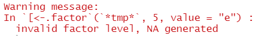
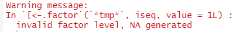

```{r setup, include = FALSE}

options(htmltools.dir.version = FALSE)
knitr::opts_chunk$set(echo = FALSE, comment = "")
xaringanthemer::style_mono_accent(title_slide_background_color = "#EDF4FB",
                                  title_slide_text_color = "#000000",
                                  base_font_size = "18px")
Sys.setenv(LANG = "en")
library(knitr)
# library(printr)
```

# What Can Go Wrong With Factors in R

* ### Invalid factor levels

--

* ### Recoding factors wrongly

--

* ### Converting factors to numeric

--

```{r}

```

---

# Invalid Factor Levels

.pull-left[

### Single Vector
```{r, echo = TRUE}
f <- factor(letters[1:4])
f
```

```{r, echo = TRUE, eval = FALSE}
f[5] <- "e"
```

]

--

.pull-right[

### Data Frame

```{r, echo = TRUE, eval = FALSE}
df <- data.frame(
  q1 = factor(c("strongly agree", 
                "agree", "disagree"))
)

df_new <- data.frame(
  q1 = factor("strongly agreed") #<<
)

df_total <- df
df_total[4, ] <- df_new #<<

```



*** It's not a bug - it's a feature ***  
** R detects wrong spelling in new data **

]

---

# Invalid Factor Levels: Solutions

.pull-left[
### Single Vector

#### Define New Factor Level

```{r, echo = TRUE}
levels(f) <- c(levels(f), "e")
f[5] <- "e"

f
```

#### Use c()

```{r}
f <- factor(letters[1:4])
c(f, factor("e"))

```

]

--

.pull-right[
### Data Frame: Joining Function

```{r, echo = TRUE, results = "hold"}

df <- data.frame(
  q1 = factor(c("a", "b"))
)

df_new <- data.frame(
  q1 = factor("c") #<<
)

merge(df, df_new, all = TRUE) #<<
# rbind(df, df_new)
# dplyr::bind_rows(df, df_new)
# dplyr::full_join(df, df_new)
```

Use **dplyr's** `left_join() / right_join()` <br>if you don't want all results from both datasets.

]

---

# Recoding Factors Wrongly

```{r, echo = TRUE}
winners <- c("Susan", "Michael", "Susan", "Susan")
winners

winners <- as.factor(winners)
winners
```

### Let's Recode the Player Names ...

```{r recode, echo = TRUE, eval = FALSE}
levels(winners) <- c("Suze", "Mike") #<<
winners
```

--

```{r, ref.label = "recode"}
```

---

# Recoding Factors: Do Better

.pull-left[
### Respect Alphabetic Order<br>of Factor Levels

#### Base R

```{r, echo = TRUE}
winners <- c("Susan", "Michael", "Susan", "Susan")
winners

winners <- as.factor(winners)
levels(winners) <- c("Mike", "Suze") #<<
winners
```

]

.pull-right[
### Better: Use Explicit Recoding

#### The forcats Package

```{r, echo = TRUE}
winners <- factor(c("Susan", "Michael",
                    "Susan", "Susan"))

winners <- forcats::fct_recode( #<<
  winners,
  Suze = "Susan", #<<
  Mike = "Michael" #<<
)
winners

```

You can use `dplyr::recode()`, but it has an unintuitive order of arguments and is no longer recommended.
]
 
---

# Converting Factors to Numeric

.pull-left[

### The Classical Gotcha

```{r, echo = TRUE}
f <- factor(6:10)
f
as.numeric(f) #<<
```

### A c() Surprise

```{r}
f <- factor(letters[1:4])

f2 <- c(f, "e") #<<
f2

```


]

--

### Better

```{r}
f |>
  as.character() |>  #<<
  as.numeric()

# Same as
as.numeric(as.character(f))

# Recommended in R's documentation
# See ?factor
as.numeric(levels(f))[f] #<<
```


---

class: center, middle

# Thanks!

### Youtube: StatistikinDD

### Twitter: @StatistikinDD

### github: fjodor

Slides created via the R package [**xaringan**](https://github.com/yihui/xaringan).

The chakra comes from [remark.js](https://remarkjs.com), [**knitr**](https://yihui.org/knitr), and [R Markdown](https://rmarkdown.rstudio.com).

Thanks to **Yihui Xie** for *{knitr}* and *{xaringan}* and **Garrick Aden-Buie** for *{xaringanthemer}*.
